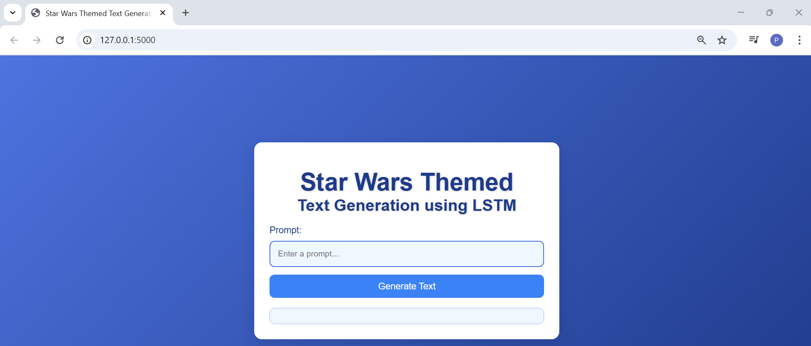
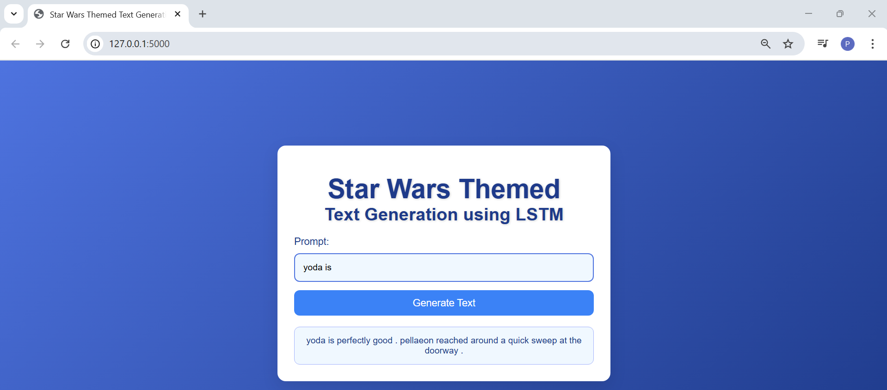

# A2 - Language Model
# LSTM Language Model with Flask Web Application

This project demonstrates the use of an **LSTM (Long Short-Term Memory)** language model for text generation. A Flask web application is utilized to provide an interactive interface, where users can input a prompt and receive a continuation of the prompt generated by the model.

## Files Overview

- `README.md`: This file, containing documentation on how to use the project.
- `requirements.txt`: Contains the necessary Python packages required for the project.
- `app.py`: The main Flask web application that runs the model and displays the generated text.
- `templates/index.html`: HTML file for the Flask app’s front-end.
- `model.py`: Contains the definition of the `LSTMLanguageModel` class, which implements the LSTM-based language model.
- `A2.ipynb`: Jupyter notebook used for training the LSTM model and experimenting with different configurations.
- `best-val-lstm_lm.pt`: The saved state dict of the trained LSTM model, which is loaded for inference in the app.
- `vocab.pkl`: A pickle file containing the vocabulary used by the model for text generation.
- `images/`: Folder containing screenshots of the web application (e.g., `homepage.png` and `sample-prompt.png`)

## Dataset
The dataset used for training the model is the **Star Wars dataset** from Hugging Face, titled *myothiha/starwars*. It consists of 25,197 text samples drawn from dialogues and narratives within the Star Wars universe, making it well-suited for generating contextually relevant text in a Star Wars-like style.

**Dataset Source:** Hugging Face Datasets, *myothiha/starwars*

**Available at:** [Hugging Face - myothiha/starwars](https://huggingface.co/datasets/myothiha/starwars)

## Setup and Running the Application

**1. Clone the repository:** 
Clone the repository to your local machine.
```bash
git clone https://github.com/Prapatsorn-A/a2-language-model.git
cd a2-language-model/app
```

**2. Install dependencies:** 
Install the dependencies listed in `requirements.txt`.
```bash
pip install -r requirements.txt
```

**3. Running the Flask App:**
To start the Flask web application, run the following command:
```bash
python app.py
```
This will start the app on `http://127.0.0.1:5000/`.

## Features of the Web Application
- **Text Generation**: Users can input a prompt (e.g., "yoda is") and the model generates a continuation based on the input.
  
- **Interactive Interface**: A simple text box is provided for entering the prompt, with a 'Generate Text' button to trigger the generation process.

- **Contextually Relevant Output**: The model predicts the next word in the sequence, building a continuation that flows from the given prompt.
  
- **Real-Time Display**: The generated text is displayed immediately below the input box, allowing users to view the model's response instantly.

## Web Application Sample Screenshots

**Screenshot 1: Homepage**

This screenshot shows the initial homepage of the web application, where the user can input a text prompt.



**Screenshot 2: Text Generation Output**

This screenshot displays the result after the user entered the prompt **"yoda is"** and clicked **"Generate Text."** The model processes the input and generates a continuation of the text as an output.

